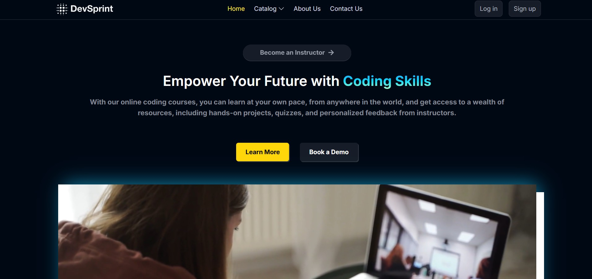
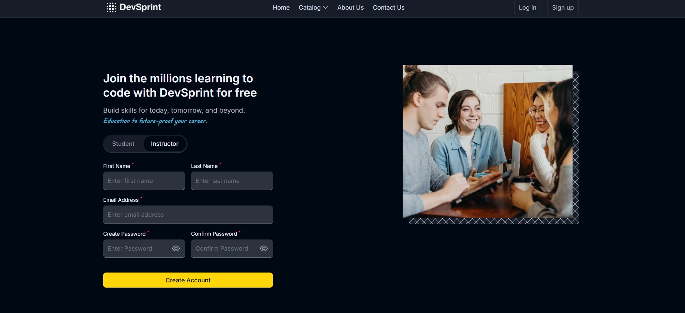
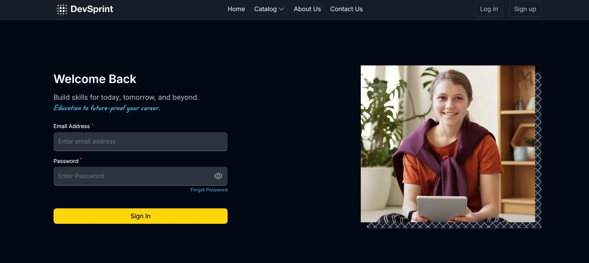

# 🚀 DevSprint  
**Live Preview:** [Click here to explore DevSprint](https://dev-sprint-inky.vercel.app/)  


DevSprint is a comprehensive EdTech web platform that empowers instructors to create engaging learning experiences and enables students to explore, purchase, and engage with educational content. Built with the robust **MERN** stack—**MongoDB**, **Express.js**, **React.js**, and **Node.js**—this platform seamlessly integrates modern web technologies to deliver dynamic learning and teaching experiences.

---

## 📚 Table of Contents

- [Overview](#overview)
- [Architecture Breakdown](#architecture-breakdown)  
  - [Client-Side](#client-side)  
  - [Server-Side](#server-side)  
  - [Database Design](#database-design)  
  - [System Flow Diagram](#system-flow-diagram)
- [API Structure](#api-structure)
- [Local Setup Guide](#local-setup-guide)
- [Environment Setup](#environment-setup)
- [Running the Project](#running-the-project)

---

## 🧠 Overview

DevSprint bridges the gap between learners and educators by offering a rich suite of tools to host, consume, and evaluate educational resources. With a mobile-friendly UI and powerful backend capabilities, it supports content-driven learning at scale. Instructors can showcase their courses, while students can browse, wishlist, and purchase content with ease.

---

## 🏗️ Architecture Breakdown

DevSprint is built on a **client-server model**, where the React-based frontend communicates with a Node.js and Express.js backend, connected to a MongoDB database.

### 🖼️ Client-Side

The frontend leverages **ReactJS** for building an intuitive and interactive user interface. Tailwind CSS is used for styling, and **Redux** handles global state management.

#### 👨‍🎓 Student Interfaces

- **Landing Page**: Highlights platform features and directs users to key sections.
- **Course Catalogue**: Displays a searchable, filterable list of available courses.
- **Wishlist**: Lets users bookmark courses they’re interested in.
- **Checkout Page**: Streamlines the course purchasing experience.
- **Course Viewer**: Shows video lectures and supplemental materials.
- **Account Info & Edit**: Enables users to manage and update their profile details.

#### 👩‍🏫 Instructor Interfaces

- **Dashboard**: Gives a bird’s-eye view of created courses and received feedback.
- **Analytics**: Offers data insights including views, clicks, and engagement.
- **Course Manager**: Interface for creating, editing, or removing course content.
- **Profile Settings**: Allows instructors to personalize their account.

### 🧩 Tools & Libraries (Frontend)

- **ReactJS**: UI rendering  
- **Tailwind CSS**: Component styling  
- **Redux**: State management  

---

### 🧠 Server-Side

The backend is built using **Node.js** and **Express.js**, delivering a suite of RESTful APIs that serve data to the frontend. The backend also handles authentication, data processing, and media storage.

#### ⚙️ Core Functionalities

- **User Auth**: Includes sign-up/sign-in, password recovery, and OTP validation.
- **Course Management**: Instructors can CRUD course data; students can view and rate.
- **Payment Gateway**: Razorpay integration for secure transactions.
- **Media Hosting**: Assets like videos and thumbnails are managed via **Cloudinary**.
- **Markdown Support**: Content authored using Markdown for flexible formatting.

#### 🛠️ Backend Stack

- **Node.js + Express.js**: Web server and routing  
- **MongoDB + Mongoose**: Database and ODM  
- **JWT**: Secure token-based authentication  
- **Bcrypt**: Password encryption  
- **Cloudinary**: Cloud storage for media files  

---

### 🗃️ Database Design

Data persistence is handled via **MongoDB**, chosen for its flexibility with unstructured data.

#### Screenshots







#### 🔑 Key Schemas

- **User (Student/Instructor)**: Stores profile and authentication details.  
- **Course**: Includes metadata, instructor linkage, pricing, and media paths.


---

### 🧭 System Flow Diagram

A high-level overview of DevSprint’s architecture:


---


## 🧪 API Structure

DevSprint follows **RESTful API principles**, ensuring clean, modular endpoints that are easy to maintain and scale. All data exchanges are performed in **JSON** format, and the API supports methods like `GET`, `POST`, `PUT`, and `DELETE`.

📘 For the full API spec, see the [API Docs](/api-docs).

---

## 🛠️ Local Setup Guide

Get started with DevSprint on your machine:

```bash
# 1. Clone the project
git clone https://github.com/Gourish112/DevSprint

# 2. Run project
npm run dev
```

#### 📬 Contact

Created by **Gourish Bhatia**  
📧 Email: gourishbhatia2004@gmail.com
